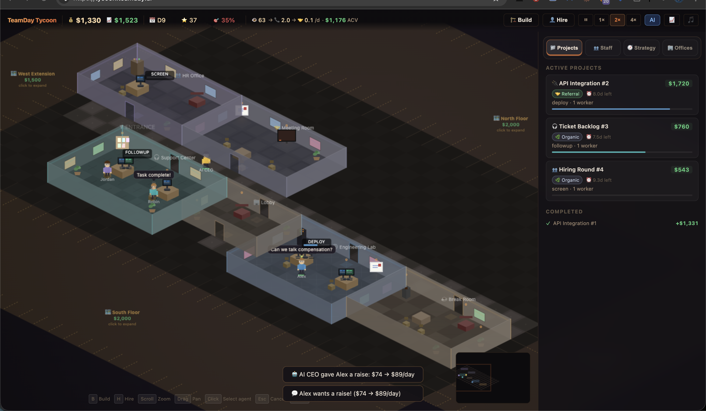

<p align="center">
  
</p>

<h1 align="center">Business Tycoon</h1>

<p align="center">
  <strong>An open-source isometric AI office simulator you can play right in your browser.</strong><br>
  Build your startup from a tiny studio to a tech empire. No install, no sign-up, no paywall.
</p>

<p align="center">
  <a href="https://tycoon.teamday.ai"><strong>Play Now</strong></a> &nbsp;&middot;&nbsp;
  <a href="https://discord.gg/srN4Z8jm">Discord</a> &nbsp;&middot;&nbsp;
  <a href="https://github.com/TeamDay-AI/business-tycoon">GitHub</a> &nbsp;&middot;&nbsp;
  <a href="https://github.com/TeamDay-AI/business-tycoon/issues">Report Bug</a>
</p>

<p align="center">
  <a href="https://github.com/TeamDay-AI/business-tycoon/stargazers"></a>
  <a href="https://discord.gg/srN4Z8jm"></a>
  
  
  
</p>

---

## What is Business Tycoon?

Business Tycoon is a free, browser-based tycoon game where you run an AI startup. You start with a small office and a dream — hire AI agents, assign them to projects, research new tech, manage your finances, and grow your company level by level.

Everything runs client-side. No server, no database, no accounts. Just open the link and play.

### Gameplay

- **Build your office** — Place rooms, corridors, and furniture in an isometric office builder. Expand as you grow.
- **Hire AI agents** — Each agent has unique skills, a personality, and mood that affects their work. Keep them happy.
- **Take on projects** — Accept client projects that match your team's skills. Deliver on time to build your reputation.
- **Research & unlock** — Progress through a tech tree to unlock new room types, better equipment, and company perks.
- **Manage your economy** — Track MRR, handle cash flow, take loans, and navigate market events like booms and crashes.
- **Random events** — VC offers, office disasters, market shifts — adapt your strategy on the fly.
- **AI CEO advisor** — Get strategic advice from an AI-powered advisor (optional, uses external API).
- **Installable PWA** — Works offline after first load. Install it on your phone or desktop.

## Getting Started

### Play instantly

**[tycoon.teamday.ai](https://tycoon.teamday.ai)** — click and play, nothing to install.

### Run locally

Clone the repo and serve the files with any static HTTP server:

```bash
git clone https://github.com/TeamDay-AI/business-tycoon.git
cd business-tycoon

# Pick one:
python3 -m http.server 8000
# or
npx serve .
```

Open `http://localhost:8000` and you're in.

**No build step. No bundler. No dependencies.** It's vanilla JavaScript with ES modules loaded directly by the browser.

## Project Structure

```
business-tycoon/
├── index.html              # Entry point — everything starts here
├── sw.js                   # Service worker (offline/PWA support)
├── manifest.json           # PWA manifest
├── src/
│   ├── main.js             # Bootstrap & game loop
│   ├── game.js             # Global game state (the G singleton)
│   ├── engine.js           # Canvas, camera, input handling
│   ├── config.js           # All game balance, catalogs, and constants
│   ├── simulation.js       # Per-tick simulation (daily/weekly cycles)
│   ├── economy.js          # Revenue, costs, valuation, client pipeline
│   ├── progression.js      # Levels, tech tree, company stages
│   ├── events.js           # Random events (VC offers, disasters, etc.)
│   ├── agent.js            # AI agent behavior, skills, mood, pathfinding
│   ├── visitor.js          # Office visitor NPCs
│   ├── project.js          # Project creation & management
│   ├── recruitment.js      # Hiring system & candidate generation
│   ├── map.js              # Room placement, corridors, doors
│   ├── floorplan.js        # Office layouts & expansion zones
│   ├── build-mode.js       # Construction UI (drag-to-build)
│   ├── rotation.js         # Furniture/room rotation
│   ├── pathfinding.js      # A* grid pathfinding
│   ├── audio.js            # Background music
│   ├── sfx.js              # Procedural sound effects (Web Audio API)
│   ├── ai-ceo.js           # AI CEO advisor (external API)
│   ├── renderer/           # Isometric rendering layers
│   │   ├── index.js        #   Render orchestrator & depth sorting
│   │   ├── floor.js        #   Floor tiles
│   │   ├── walls.js        #   Wall rendering
│   │   ├── furniture.js    #   Office furniture
│   │   ├── agents.js       #   Agent sprites
│   │   ├── effects.js      #   Visual effects
│   │   ├── minimap.js      #   Minimap overlay
│   │   └── primitives.js   #   Shared isometric drawing helpers
│   └── ui/                 # UI panels & overlays
│       ├── panels.js       #   Main panels (agent details, projects, company)
│       ├── build-panel.js  #   Construction mode panel
│       ├── equipment-panel.js
│       ├── hud-popover.js  #   HUD tooltips
│       ├── speed.js        #   Game speed controls
│       ├── toast.js        #   Notification toasts
│       ├── intro.js        #   Onboarding & level intros
│       ├── cashflow-graph.js
│       ├── floating-chart.js
│       ├── analytics-panel.js
│       ├── strategy-panel.js
│       └── loan.js         #   Loan/debt management
├── assets/
│   ├── *.mp3               # Background music tracks
│   └── team/               # Agent avatar images (.webp)
└── og-image.jpg            # Social sharing image
```

## Contributing

We'd love your help! Business Tycoon is fully open source under the MIT license. Join the [Discord community](https://discord.gg/srN4Z8jm) to chat with other contributors.

### Ways to contribute

- **Report bugs** — [Open an issue](https://github.com/TeamDay-AI/business-tycoon/issues) with steps to reproduce
- **Suggest features** — Have an idea? [Open an issue](https://github.com/TeamDay-AI/business-tycoon/issues) and describe what you'd like to see
- **Submit a PR** — Fork the repo, make your changes, and open a pull request
- **Improve game balance** — Tweak numbers in `src/config.js` and share what feels better
- **Add content** — New events, room types, furniture, agent personalities, tech tree nodes
- **Fix typos & polish** — Every little improvement counts

### How to contribute

1. **Fork** the repository
2. **Clone** your fork locally
3. **Create a branch** for your change (`git checkout -b my-feature`)
4. **Make your changes** — no build step needed, just edit and refresh
5. **Test** by running a local server and playing the game
6. **Commit** and **push** to your fork
7. **Open a pull request** against `main`

Since there's no build step or test suite, just make sure the game loads and runs without console errors.

### Ideas for first contributions

- Add new random events in `src/events.js`
- Create new office furniture definitions in `src/config.js`
- Improve agent pathfinding in `src/pathfinding.js`
- Add keyboard shortcuts for common actions
- Improve mobile/touch support
- Add new background music tracks
- Localization / i18n support

## Tech Stack

| What | How |
|------|-----|
| Language | Vanilla JavaScript (ES modules) |
| Rendering | HTML5 Canvas 2D, isometric projection |
| Audio | Web Audio API (procedural SFX) + MP3 (music) |
| UI | Mix of canvas-drawn elements + DOM overlays |
| Offline | Service Worker + PWA manifest |
| Build | None. Zero dependencies. |
| Hosting | Any static file server |

## License

[MIT](LICENSE) — do whatever you want with it. Fork it, mod it, learn from it, ship it.

## Community

- [Discord](https://discord.gg/srN4Z8jm) — chat, share ideas, get help
- [GitHub Issues](https://github.com/TeamDay-AI/business-tycoon/issues) — bugs & feature requests
- [TeamDay.ai](https://www.teamday.ai) — the team behind the game
